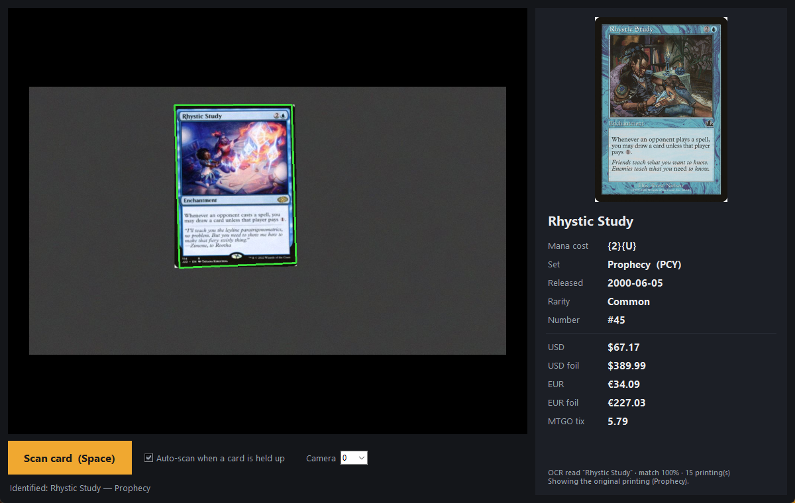

# MTG Card Scanner

Prinesite *Magic: The Gathering* kartu web kameri i dobit ćete njezin **naziv**,
**mana cijenu**, **koje izdanje karte držite u ruci** te **trenutnu cijenu tog
izdanja**.

```
python mtg_scanner.py
```



Otvara se prozor sa slikom kamere uživo. Kada se karta prepozna, dobiva zeleni
obrub i automatski se skenira; skeniranje možete pokrenuti i tipkom **Space**
ili gumbom **Scan card**. Rezultati se prikazuju s desne strane, zajedno sa
slikom karte sa Scryfalla, kako biste mogli potvrditi da je pročitana prava
karta.

## Preduvjeti

Python 3.9+ i [Tesseract OCR](https://github.com/UB-Mannheim/tesseract/wiki).

Aplikacija sama pronalazi Tesseract: redom provjerava varijablu okoline
`TESSERACT_CMD`, zatim `tesseract` na `PATH`-u, pa uobičajene lokacije
instalacije (`C:\Program Files\Tesseract-OCR\tesseract.exe` na Windowsu,
`/usr/bin/tesseract` i `/usr/local/bin/tesseract` na Linuxu). Ako je Tesseract
negdje drugdje, postavite `TESSERACT_CMD`.

```
pip install -r requirements.txt
```

Podaci o kartama i cijene dolaze sa [Scryfall API-ja](https://scryfall.com/docs/api).
Za prvo pokretanje potrebna je internetska veza; nakon toga se katalog naziva
karata lokalno sprema tjedan dana, a popisi izdanja 12 sati.

## Opcije

```
python mtg_scanner.py                  # GUI, zadana kamera
python mtg_scanner.py --camera 1       # druga web kamera
python mtg_scanner.py --image karta.jpg  # prepoznavanje spremljene slike, ispis u stdout
```

Padajući izbornik s kamerama omogućuje prebacivanje između web kamera bez
ponovnog pokretanja. **Esc** zatvara aplikaciju.

## Kako dobiti dobar sken

* Karta neka zauzima pristojan dio slike — otprilike polovicu visine.
* Ravnomjerno osvjetljenje; izbjegavajte odsjaj preko naslovne trake, jer se
  upravo taj dio čita.
* Karte u zaštitnoj foliji nisu problem. Nakošene karte također nisu problem,
  karta se prvo poravna.
* Naopako okrenute karte se prepoznaju, samo traju sekundu dulje.

## Kako radi

1. **Detekcija** karte kao četverokuta u sličici. Isprobava se pet različitih
   binarizacija (adaptivni prag, automatski Canny na slici s izjednačenim
   kontrastom, Otsu i njegov inverz te obični Canny), jer karta s tamnim
   obrubom na tamnom stolu pod jednom metodom gotovo da nema rub, a pod drugom
   daje čistu siluetu. Kandidati se rangiraju po tome koliko su blizu omjeru
   stranica karte 63:88, a ne po veličini — najveća kontura u sličici obično je
   pozadina.
2. **Poravnanje** na sliku fiksne veličine 488x680 perspektivnom
   transformacijom.
3. **Čitanje** naslovne trake Tesseractom. Tri okomita pojasa (različiti okviri
   karata stavljaju naziv na malo različite visine) puta četiri predobrade
   (Otsu, adaptivni prag, top-hat, obična sivkasta slika) slažu se u jednu
   visoku sliku i OCR-aju u jednom pozivu — svaki `pytesseract` poziv pokreće
   podproces, pa je grupiranje dvanaest isječaka spustilo trajanje skena s
   ~20 s na ~2 s.
4. **Podudaranje** dobivenih redaka sa svim nazivima karata sa Scryfalla pomoću
   biblioteke RapidFuzz.
5. **Dohvat** svih izdanja pronađene karte, pa utvrđivanje koje se od njih
   zapravo nalazi pred kamerom, na temelju sitnog teksta uz donji rub karte.
   Taj je redak višestruko manji od naslova, pa dobiva vlastito poravnanje
   izvorne sličice na 5x kanonsku veličinu — pri veličini na kojoj se čita
   naslov, ta su slova ispod svega što Tesseract može razlučiti.

### O odgovorima koje daje

Prikazani set i cijena odnose se na **izdanje koje držite u ruci**, pročitano s
donjeg ruba karte. Koji su signali ondje dostupni ovisi o starosti okvira
karte:

| Tiskano od | Signal | Primjer |
| --- | --- | --- |
| 2014. (M15 okvir) | oznaka seta uz jezik | `2XM • EN` |
| ~1998. | kolekcionarski broj i veličina seta | `248/383` |
| ~1995. | godina autorskih prava | `™ & © 1993-2007 Wizards of the Coast` |

Nijedan od njih nije dostupan svugdje, pa se svi zajedno boduju umjesto da se
pouzdajemo u jedan po jedan. Oznaka seta gotovo je presudna ondje gdje je uopće
otisnuta; kolekcionarski broj i veličina seta zajedno gotovo jednako tako;
svaki od njih zasebno tek je naznaka; a godina je previše gruba da bi sama
išta odlučila — svaki osnovni set jedne ere dijeli istu veličinu, pa `249`
znači bilo što od M10 do M13 dok godina ne izdvoji jedan. Izdanje mora prijeći
prag **i** nadmašiti svaki drugi set prije nego što bude prijavljeno.

Kada dokazi ne dosegnu taj prag, panel se vraća na izvorno izdanje karte i
navodi da redak sa setom nije bio čitljiv, umjesto da fallback predstavi kao
nalaz. Karte tiskane prije otprilike 1998. uopće nemaju kolekcionarski broj, pa
po samoj naravi završavaju ovdje. To je isti instinkt kao i kod podudaranja
naziva u nastavku: nikakav odgovor bolji je od samouvjereno pogrešnog.

Podudaranje je namjerno konzervativno: radije će reći *„no card recognised”* i
pustiti vas da ponovno skenirate, nego dati samouvjereno pogrešan odgovor. Tri
pravila obavljaju većinu tog posla:

* približno podudaranje mora zadržati većinu OCR teksta (kako loše očitanje
  karte *Sylvan Library* ne bi potiho postalo karta koja se doista zove
  *Library*),
* kratak naziv karte ne može se podudariti s osjetno duljim očitanjem,
* prag podudaranja iznosi **82 %**. Naslov koji predobrade uopće ne uspiju
  razlučiti i dalje daje šum, a dovoljno dug redak šuma slučajno padne u visoke
  sedamdesete uz neku stvarnu kartu: *Rhystic Study* u okviru seta Prophecy
  čita se kao `PRESSION GRASSY`, što je 80 % podudaranje s kartom *Suppression
  Ray*. Mjereno na `testdata/`, svako ispravno podudaranje ima rezultat 83 % ili
  bolji, pa prag pripada u prozor između te dvije vrijednosti.

## Testovi

`test_scanner.py` pušta cjevovod preko slika u `testdata/` i uspoređuje
rezultate sa zabilježenim očekivanim vrijednostima.

```
python test_scanner.py           # svi skupovi
python test_scanner.py val       # samo jedan
```

Trenutni rezultati — 36/40 karata ispravno imenovano, **0 pogrešnih odgovora**:

| Skup | Što je to | Rezultat |
| --- | --- | --- |
| `scans` | ravni skenovi karata, bez perspektive | 5/5 |
| `photos` | sintetske snimke web kamere: perspektiva, šum, zamućenje | 12/12 |
| `val` | grublje i neviđeno: rotacija, male karte, gradijent osvjetljenja, JPEG artefakti | 16/20 |
| `multiface` | dvostrane i podijeljene karte | 3/3 |

Sva četiri promašaja u skupu `val` vraćaju „nije prepoznato”, a ne pogrešnu
kartu. Taj je skup namjerno teži od stvarne sesije s web kamerom — karte
zauzimaju tek pola visine slike, zaokrenute su do 12°, pri JPEG kvaliteti 72.

Skup `printings` boduje se zasebno, jer je „koje je ovo izdanje” drugo pitanje
od „koja je ovo karta”. Svaka je slika u njemu ponovno izdanje, pa bi skener
koji uvijek prijavljuje izvorno izdanje ovdje imao nula bodova:

| Rezultat | Broj |
| --- | --- |
| točan set | 19/23 |
| redak sa setom nečitljiv, vraćeno na izvorno izdanje uz napomenu | 3 |
| karta uopće nije prepoznata | 1 |
| **pogrešan set** | **0** |

Dva od tri fallbacka su karte iz 1995. i 1997., koje nemaju otisnut
kolekcionarski broj koji bi se mogao pročitati. Jedina neprepoznata karta je
*Rhystic Study* iz seta Prophecy, čiji ukrasni serifni naslov na mramoriranoj
podlozi nijedna od četiriju predobrada ne uspijeva razlučiti; prag podudaranja
od 82 % osigurava da to završi kao „nije prepoznato”, a ne kao pogrešna karta.

Čitanje retka sa setom košta otprilike jednu dodatnu sekundu po skenu — riječ
je o još jednom OCR prolazu u punoj veličini, a dva preklapajuća isječka koja
koristi upravo su ono što broj pogrešnih odgovora drži na nuli.

## Datoteke

| Datoteka | Namjena |
| --- | --- |
| `mtg_scanner.py` | cijela aplikacija |
| `test_scanner.py` | regresijski testovi |
| `testdata/` | testne slike i njihovi očekivani rezultati |
| `screenshot.png` | prozor aplikacije, usred skeniranja |
| `cache/` | Scryfall odgovori i slike karata (izuzeto iz gita) |

> Komentari i docstringovi u izvornom kodu ostali su na engleskom, kako bi kod
> ostao usklađen s nazivljem Scryfall API-ja, OpenCV-a i Tesseracta.
